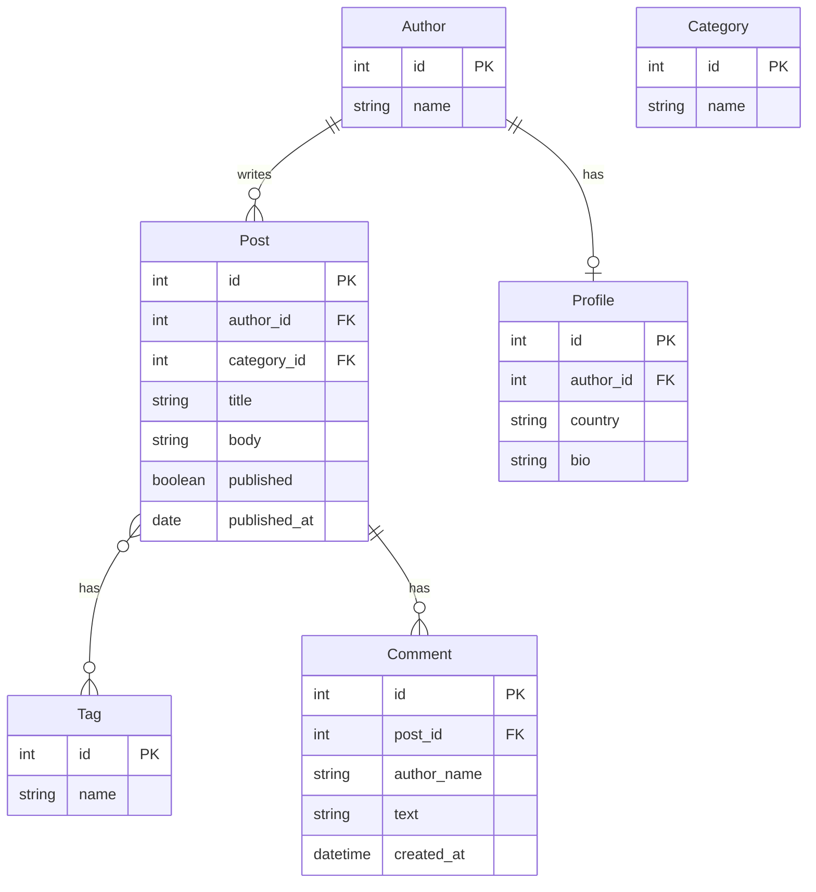

# Diagrama de Modelos - Blog

## Modelo Author
- id (PK)
- name (CharField, max_length=100)

## Modelo Profile
- id (PK)
- author (OneToOneField -> Author, related_name="profile")
- country (CharField, max_length=60)
- bio (TextField, blank=True)

## Modelo Category
- id (PK)
- name (CharField, max_length=60, unique=True)

## Modelo Tag
- id (PK)
- name (CharField, max_length=40, unique=True)

## Modelo Post
- id (PK)
- title (CharField, max_length=200)
- body (TextField, blank=True)
- author (ForeignKey -> Author, related_name="posts")
- category (ForeignKey -> Category, null=True, blank=True, related_name="posts")
- tags (ManyToManyField -> Tag, blank=True, related_name="posts")
- published (BooleanField, default=False)
- published_at (DateField, null=True, blank=True)

## Modelo Comment
- id (PK)
- post (ForeignKey -> Post, related_name="comments")
- author_name (CharField, max_length=100)
- text (TextField)
- created_at (DateTimeField, auto_now_add=True)

## Relaciones
- Author 1:1 Profile (OneToOneField)
- Author 1:N Post (ForeignKey)
- Category 1:N Post (ForeignKey, nullable)
- Post N:M Tag (ManyToManyField)
- Post 1:N Comment (ForeignKey inverso)

